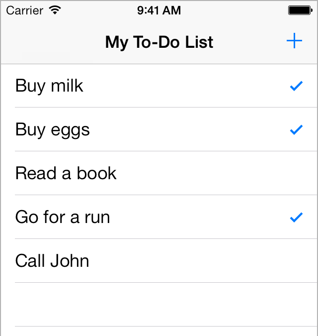
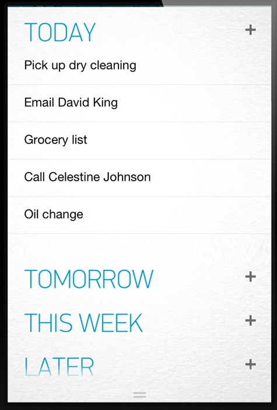

# TP Programmation Application Mobile iOS

La version [pdf](TP-todolist.pdf) de ce sujet est également disponible.

# Introduction

L'objectif des séances de TP est de développer une application complète de type Gestionnaire de tâches (Todo list). Le développement de cette application sera fait en respectant le modèle MVC et se décomposera en plusieurs phases, chacune d'elles permettant d'ajouter de nouvelles fonctionnalités.

Le développement se fera en binôme. Le sujet étant suffisamment vaste, chaque binôme d'étudiants sera libre d'implémenter « à sa manière » le problème posé.

Attention de bien faire une sauvegarde (dans le cloud ou clé USB) après chaque séance de TP car les espaces de stockage sur les Mac de la salle GR03 peuvent être réinitialisés sans avertissement lors des mises à jour des machines.

Toutes les fonctionnalités demandées n'ont pas forcément été vues lors des TDs (par manque de temps) mais leur programmation est présentée en détail sur la chaine YouTube du cours.

[https://youtube.com/playlist?list=PL0Z31Yjf1Bk00k2OIgv8HhYxzOjhO69M3](https://youtube.com/playlist?list=PL0Z31Yjf1Bk00k2OIgv8HhYxzOjhO69M3)

# 1. Conception du modèle de données

En swift, proposer une classe Todo qui servira de modèle de données à l'application. Une tâche ou todo sera composée au minimum d'un nom et d'une description (permettant si besoin de donner des détails sur la tâche). Par exemple, la tâche « Faire les courses » avec la description « Lait, biscuits, conserves, viande, eau, … ».

# 2. Création du Storyboard et Programmation de l'application

L'application sera construite sur le principe d'un TableView vu en TD et sera constituée de plusieurs vues :

- La première vue affichera la liste des taches comme sur la figure ci-dessus.
- Une deuxième vue permettra d'afficher le détail de la tâche
- Une troisième vue permettra de créer une nouvelle tâche

Différents moyens d'intéraction seront également intégrées dans l'application

- Un bouton permettra d'ajouter une nouvelle tâche dans la 3ème vue mentionnée ci-dessus.
- Une case à cocher ou un bouton permettront de modifier le statut de la tâche (de « à faire » à « faite » ou inversement)
- Un bouton permettra de supprimer une tâche

# 3. Ajout de la date de réalisation

Ajouter la date de réalisation de la tâche et mettre en place un tri des tâches par ordre croissant des dates. Un affichage particulier pourra être éventuellement mis en place comme dans la figure ci-dessous.

# 4. Ajout de catégories

On souhaite maintenant créer des catégories différentes (par exemple Perso et Travail) pour stocker des tâches différentes dans des contextes différents. Pour cela, proposer une nouvelle classe TodoList qui contiendra le nom de la catégorie et un tableau des taches à stocker dans la catégorie correspondante.

Modifier l'application pour ajouter une vue initiale qui listera toutes les catégories déjà existantes (dans un TableView) et permettra de créer une nouvelle catégorie et effacer une catégorie existante. Un clic sur une catégorie permettra d'afficher les tâches de cette catégorie.

# 5. Ajout d'un moteur de recherche

Dans la vue listant les tâches d'une catégorie, ajouter un champ recherche permettant de filtrer les tâches à afficher.